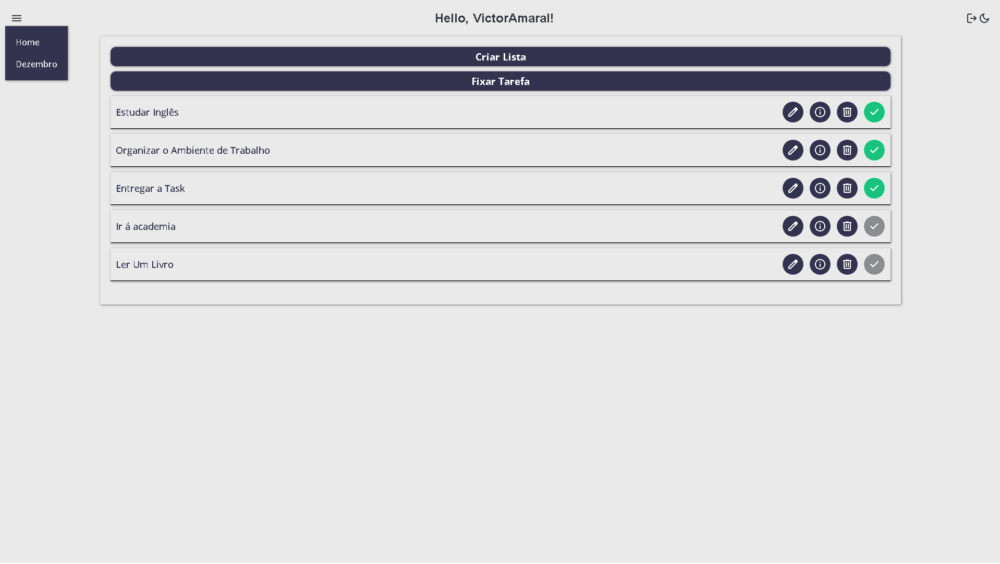
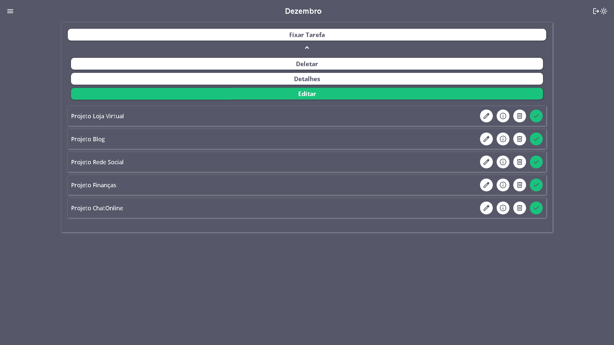
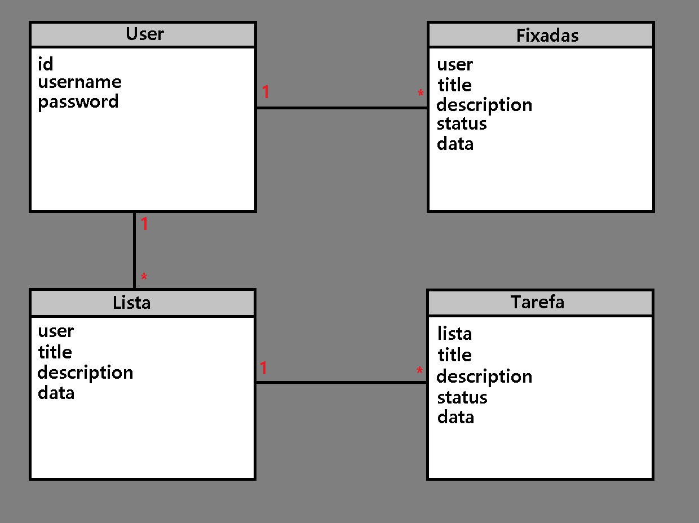
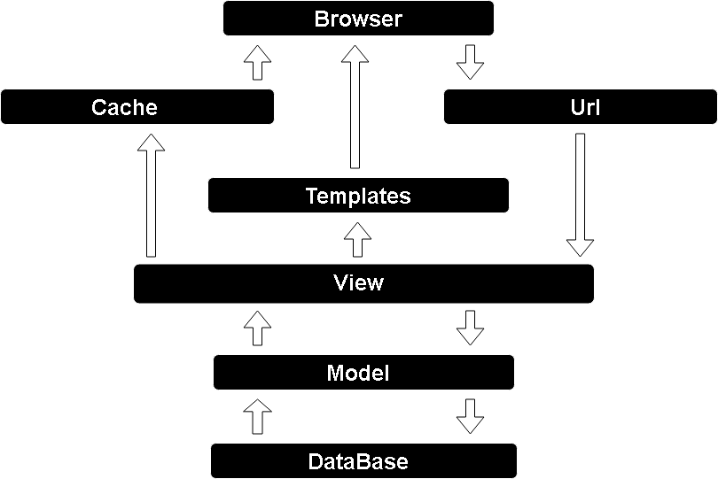

# ClearMind


ClearMind, inspired by the widely recognized Notion app, aims to simplify the process of setting short and long-term goals.

With an intuitive visual interface, we seek to provide a clear and objective experience to help you achieve your daily goals with ease, and it's Especially reccomended to create a daily routine in your life

## Links

- [Project]()

## Home Layout



## List Layout



## Conceptual Model



## Architecture



## Videos

### Home
https://github.com/V1KILL/PROJETO-LISTA-DE-TAREFAS/assets/105511964/c0a8f3e7-66ef-4237-a19b-c648b9a9fc61

### List

https://github.com/V1KILL/PROJETO-LISTA-DE-TAREFAS/assets/105511964/d012a4b4-8d63-4c2d-8c9f-93df22b6eb69

## Features

### Authentication

- **Account Login:** Allows users to authenticate in the application.
- **Account Register:** Enables new users to create an account.

### Colors Mode

- **LightMode:** Interface with Light Background.
- **DarkMode:** Interface with Dark Background.

### Task

- **Add Task:** Allows users to create new tasks.
- **Edit Task:** Allows modification of the title and description of a task.
- **View Task Details:** Provides a detailed view of the information for a specific task.
- **Remove Task:** Allows the deletion of no longer necessary tasks.
- **Check Task:** Allows marking a task as completed or not completed.

### List

- **Add List:** Enables users to create new lists.
- **Edit List:** Allows modification of the title and description of a list.
- **View List Details:** Offers a detailed view of the information for a specific list.
- **Remove List:** Allows the deletion of no longer necessary lists.

## Technologies Used

### Back-End
- Python
- Django
- JavaScript

### Front-End
- HTML
- CSS
- JavaScript

### Deploy
- Back-End: Glitch
- Front-End: Firebase
- Database: MySQL

## Run Project

#### Prerequisite
- Python 3.11

```bash

# Clone Repository
git clone https://github.com/V1KILL/PROJETO-LISTA-DE-TAREFAS.git

# Activate Virtual Environment
.\venv\Scripts\activate

# Activate Virtual Environment (Linux)
source venv/bin/activate

# Install Dependencies
pip install -r requirements.txt

# Apply Migrations
python manage.py migrate

# Start the Server
python manage.py runserver

```
